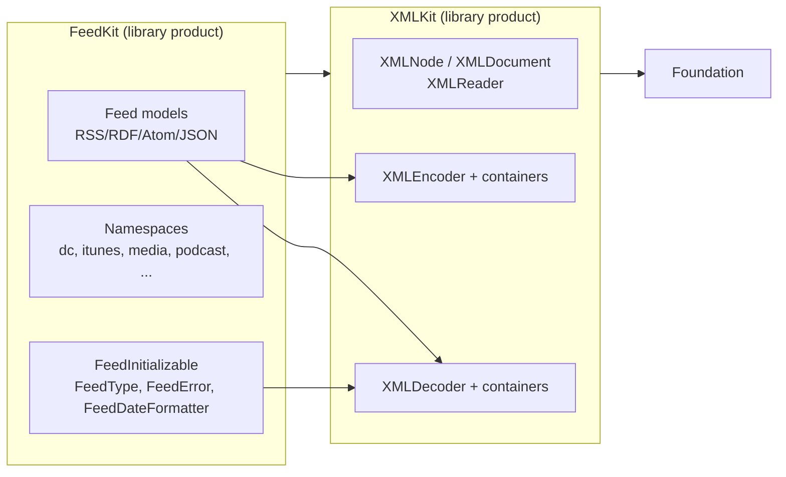
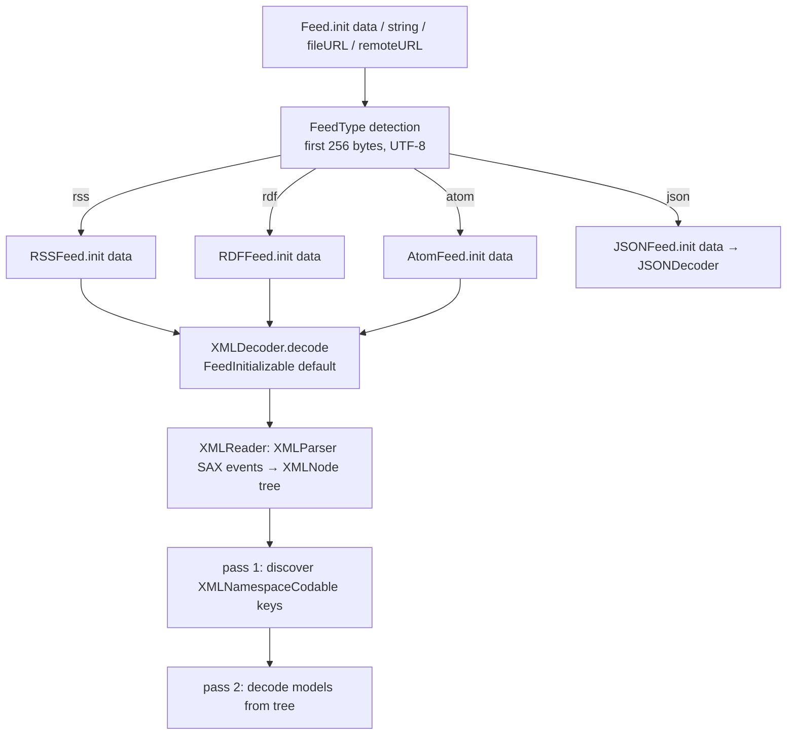

# FeedKit Architectural Review

**Repository:** `/Volumes/Development/Source/FeedKit` (git `main` @ `03e8ac2`, tags through `9.1.2`)
**Review basis:** full source inspection of `Sources/`, `Tests/`, package manifests, CI, README, example app; the package was built and its test suite executed in this session; key behaviors were verified empirically against the built libraries with small standalone harness programs.
**Updated:** 2026-09-25 — `main` @ `a853eff` plus [PR #234](https://github.com/nmdias/FeedKit/pull/234) (`fix/xml-escaping`). **C1 and H1 are fixed and covered by regression tests; every other finding stands.** Sections are annotated inline where a finding no longer holds; the original findings are kept verbatim as the record of the defect.

Conventions used throughout:

- **(Fact)** — established by reading the source or by running code.
- **(Verified)** — established by executing the built library in this session.
- **(Interpretation)** — architectural judgment drawn from the facts.
- **(Recommendation)** — proposed change.
- **(Unverified)** — not confirmed by execution; based on code inspection only.

---

## 1. Executive summary

FeedKit is in a healthy middle stage of a real architectural evolution: the old hand-written `XMLParser` delegate pipeline of the 8.x/9.x line has been replaced by a clean two-layer design — **XMLKit** (a Foundation-only XML tree + Codable encoder/decoder) and **FeedKit** (pure value-type feed models that decode through XMLKit's `XMLDecoder`, plus one JSON model family). The package builds cleanly under Swift 6.0, all 122 tests in 26 suites passed at review time (145 tests in 34 suites after #234), and the model layer is unusually complete (RSS/RDF/Atom/JSON plus 13 namespaces). The codebase is consistent, well-documented, and follows a single, repeatable model pattern.

However, the review found **four critical defects and one fundamental architectural limitation**, several of which were invisible to the test suite at the time. Two of them have since been fixed in [PR #234](https://github.com/nmdias/FeedKit/pull/234):

| # | Severity | Issue | Evidence | Status |
|---|----------|-------|----------|--------|
| 1 | **Critical** | XML serialization emits unescaped text and attribute values, producing invalid XML | `String.escapeCharacters()` exists but is never called; verified: `A & B < C` serialized raw, output fails to re-parse with `NSXMLParserErrorDomain error 68` | ✅ **Fixed in #234** (§8.1) |
| 2 | **Critical** | Namespace handling is prefix-literal, not URI-based: `<atom:feed>`, `<d:creator>` (DC under a non-canonical prefix), and prefixed Atom elements all fail to decode | `XMLReader` ignores `namespaceURI`; models hard-code keys like `"dc:title"`; verified: prefixed Atom feed → `unknownFeedFormat`/all-nil fields; `d:creator` → nil | Open (§7.1) |
| 3 | **Critical** | Public XMLKit Codable paths `fatalError()` on supported-in-principle operations (nested containers, `superEncoder`, `encodeNil`, encoding a `Date` with the default strategy) | 18 `fatalError()` sites in `XMLDecoder/` + `XMLEncoder/`; `FeedDateFormatter.string(from:)` crashes for `.permissive` | Open (§10.4) |
| 4 | **Critical** | Serialization exists only for RSS; README advertises Atom XML generation | `XMLDocumentConvertible`/`XMLStringConvertible` implemented only by `RSSFeed`; `FeedNamespace.shouldInclude(in: AtomFeed)` is dead code | Open (§8.2) |
| 5 | High | `RSSFeed.toXMLString(formatted: false)` ignores the parameter | `RSSFeed.swift:115-116` hardcodes `formatted: true` (verified) | ✅ **Fixed in #234** (§8.2) |

Positive findings of substance:

- **(Fact)** Module split is clean and unidirectional: `FeedKit → XMLKit`, XMLKit has zero FeedKit knowledge; XMLKit depends only on Foundation (+ `FoundationXML`/`FoundationNetworking` conditionals). No cycles.
- **(Fact)** Value-type domain model with a uniform `struct` + `Sendable/Equatable/Hashable/Codable` pattern; RSS 1.0 correctly reuses `RSSFeedItem`; JSON 1.1 support (`authors`, `language`) is handled with a sensible `author` fallback.
- **(Fact)** The parser tolerates real-world junk (trailing garbage after the root element, 256-byte prologs, whitespace-padded attributes) with deliberate, documented trade-offs.
- **(Fact)** CI runs Linux (swift 6.0) and an Apple matrix covering macOS/iOS/tvOS/watchOS/visionOS.
- **(Interpretation)** The two-pass "namespace container discovery" decode is a pragmatic solution to a real Codable/XML impedance mismatch, but it is undocumented, doubles model-mapping cost, and is hazardous for custom `Decodable` types with side effects.

**Bottom line:** the parsing architecture is sound enough to build on; the namespace model is not yet production-quality. The serialization path is now correct for what it covers — escaping and the ignored `formatted:` flag were fixed in #234 — but it remains RSS-only. The roadmap in §18 fixes the critical defects first, then completes serialization and hardens XMLKit, then invests in streaming/typing/quality.

---

## 2. Repository and architecture overview

### 2.1 Layout

```
Package.swift              swift-tools 6.0; products: FeedKit, XMLKit
Package@swift-5.9.swift    duplicated manifest for tools 5.9 (identical content)
Sources/XMLKit/            XML tree + Codable XML encoder/decoder (Foundation only)
Sources/FeedKit/           Feed models, namespaces, FeedInitializable, date handling
Tests/XMLKitTests/         1 fixture + 9 suites
Tests/FeedKitTests/        27 fixtures + 17 suites (swift-testing)
Example/                   SwiftUI app exercising the async API
.github/workflows/ci.yml   Linux + Apple platform matrix
```

**(Fact)** Sizes: ≈ 19,000 lines of Swift total. `XMLKit` ≈ 1,700 lines; `FeedKit` ≈ 8,000 (much of it doc comments); tests ≈ 6,000.

### 2.2 Modules and dependencies



- **(Fact)** `Package.swift:29-45`: two targets, two library products; `FeedKit` depends on `XMLKit`; test targets depend on their module. No cyclic or hidden dependencies.
- **(Fact)** `Package.swift` and `Package@swift-5.9.swift` are byte-for-byte identical in semantics. **(Interpretation)** The 5.9 manifest exists to widen the tools-version window, but CI never builds it; the two manifests must be maintained in lockstep and currently are. **Risk:** silent drift.
- **(Fact)** `.spi.yml` configures DocC for the `FeedKit` target only; XMLKit is undocumented in generated docs.

### 2.3 Execution paths

**Reading (universal `Feed`):**



**Writing (RSS only):** `RSSFeed.toXMLString(formatted:)` → `XMLEncoder` → `XMLNode` tree → `XMLDocument.toXMLString` (hardcoded header; text and attribute values escaped since #234). **JSON:** `JSONFeed.toJSONString(formatted:)` → `JSONEncoder`.

---

## 3. Functional assessment

| Capability | Status | Where | Notes |
|---|---|---|---|
| RSS 2.0 parsing | ✅ | `Feeds/RSS/` | Channel + item + enclosure/guid/cloud/image/textInput/skipDays/skipHours; complete |
| RDF (RSS 1.0) parsing | ✅ | `Feeds/RDF/` | Items correctly decoded from document root as siblings of channel (`RDFFeed.swift:26-34`) |
| Atom parsing | ✅ with gap | `Feeds/Atom/` | RFC 4287 constructs covered; **prefixed Atom documents fail** (§7.1) |
| JSON Feed 1.0/1.1 parsing | ✅ | `Feeds/JSON/` | 1.1 `authors`/`language`; `author` fallback to `authors.first` (`JSONFeed.swift:227-233`) |
| Namespace extensions | ✅ | `Namespaces/` (13) | Dublin Core, Syndication, Content, Media RSS, GeoRSS, GML, iTunes, YouTube, Podcast, Feed History, Comment API, Podlove Simple Chapters, source:markdown |
| XML generation | ⚠️ RSS only | `RSSFeed.swift:93-117` | Atom/RDF generation missing; README claims Atom (`README.md:144-172`) |
| JSON generation | ✅ | `JSONFeed.swift:249-260` | RFC 3339 dates, pretty/compact |
| Input sources | ✅ | `FeedInitializable` | URL string, URL, file URL, remote URL, string, data; remote path uses `URLSession.shared` |
| Feed-type detection | ⚠️ | `FeedType.swift` | Prefix-scan heuristic; fails prefixed Atom & non-UTF-8 prefixes (§7.1) |
| Date parsing | ✅ lenient | `FeedDateFormatter.swift` | ISO8601/RFC3339/RFC822/RFC1123 + permissive; regex fallback for weekday names |
| Error handling | ⚠️ | `FeedError`, `XMLError` | Decent `LocalizedError`/`CustomNSError`; but 3 distinct error kinds surface from one API (see §10.5) |
| Async operations | partial | `FeedInitializable` | `async` remote fetch; no cancellation, no session injection (§9) |
| Batch operations | ❌ | — | No API; consumers use Swift concurrency themselves |

**(Fact)** The `Feed` enum supports `.atom/.rss/.rdf/.json` (`Feed.swift:79-84`); **adding a fifth format is a source-breaking change** (exhaustive switch).

---

## 4. Current architecture

**(Interpretation)** The architecture is a classic three-stage pipeline with clean stage separation:

1. **Tokenize/tree**: `XMLReader` (XMLKit) consumes Foundation `XMLParser` SAX events and materializes an `XMLNode` tree. Attributes are modeled as a synthetic `"@attributes"` child node holding attribute-name/value child nodes (`XMLReader.swift:156-179`). XHTML subtrees are flattened into a single node's raw text (`XMLReader.swift:124-152`).
2. **Map**: FeedKit models decode from the tree through a custom `Decoder` (`XMLDecoder`/`_XMLDecoder`). Element name = `CodingKey.stringValue`; namespaces are handled by `XMLNamespaceCodable` marker types whose members carry prefixed keys (`"dc:title"`) and whose container key (`"dc"`) matches element prefixes via `XMLNode.hasNamespace(for:)` (`XMLNode.swift:161-163`).
3. **Model**: plain public structs.

**(Fact)** Parsing, mapping, and modelling are genuinely separated: FeedKit contains no XML parsing code, and XMLKit contains no feed knowledge. **(Interpretation)** This separation is the strongest architectural property of the codebase and is worth preserving in any future change.

Weak points of the current design:

- **(Fact)** The decoder runs `T(from:)` **twice** — a discovery pass to learn which keys are namespace containers, then the authoritative pass (`XMLDecoder.swift:50-88`). Errors from pass 1 are swallowed. **(Interpretation)** Correct for pure models, wrong for any `Decodable` with side effects; doubles mapping cost.
- **(Fact)** `XMLKeyedDecodingContainer.allKeys` is never populated ("not yet utilized", `XMLKeyedDecodingContainer.swift:44-46`), and `nestedContainer`/`superDecoder` are `fatalError()` in all containers.
- **(Fact)** The tree is class-based and mutable (`XMLNode` with `weak parent`), while the public model layer is value-type. The encoder reuses the same mutable tree for serialization.

---

## 5. Dependency and module analysis

| Question | Finding |
|---|---|
| Dependency direction | Clean: `FeedKit → XMLKit → Foundation` only |
| Circular dependencies | None |
| Separation of concerns | Parsing (XMLKit) vs modelling (FeedKit) vs transport (`FeedInitializable` default impls) vs dates (`FeedDateFormatter`) |
| Coupling FeedKit ↔ XMLKit | **Leaky in the public API**: `AtomFeedTitle`, `AtomFeedLink`, `RSSFeedGUID`, etc. are `typealias`es to `XMLKit.XMLElement<T>` / `XMLAttributesElement<T>`; every FeedKit consumer must import XMLKit to read them |
| Public vs internal | XMLKit exposes `XMLDocument`/`XMLNode`/`XMLDecoder`/`XMLEncoder` as a **separate product**, yet several members are effectively half-baked (§10.4); `FeedNamespace` is internal (good) |
| Independent evolution | XMLKit can evolve independently — but any change to `XMLElement` is an API change for FeedKit consumers (Interpretation: acceptable today, should be documented) |
| SPM structure | Appropriate; consider `XMLKit` being a standalone package/repo long-term, but in-repo target is fine |

**(Recommendation)** Keep the two-module split. Long-term, hide XMLKit generics behind dedicated public structs in FeedKit (e.g., make `AtomFeedTitle` a real struct) so consumers don't need to import XMLKit; that is a source-compatible-in-spirit but technically breaking change and belongs in a major-version bump (§16, §18).

---

## 6. Domain model assessment

### 6.1 What's good

- **(Fact)** Uniform pattern: `public struct` + memberwise `public init` + `Sendable/Equatable/Hashable/Codable` extensions. Every one of the ~90 model files follows it.
- **(Fact)** Reuse where formats genuinely share: `RSSFeedItem` is shared by RSS and RDF (`RDFFeed.swift:58`); namespace types (`DublinCore`, `Media`, `Podcast`, …) are shared across RSS/Atom/RDF items.
- **(Fact)** Optionality is permissive everywhere — appropriate for a feed-reader domain where every element is optional in practice.
- **(Fact)** JSON 1.1 semantics are modeled thoughtfully (`authors` + `language`; version inference in `JSONFeed.init`, `JSONFeed.swift:62-68`).
- **(Fact)** Typed enums where the domain is closed: `RSSFeedSkipDay` (`RSSFeedSkipDay.swift:26-38`) with case-insensitive `init(rawValue:)`.

### 6.2 Problems

| # | Problem | Evidence | Severity |
|---|---------|----------|----------|
| 1 | Weak typing for known enums/bools | `ITunes.block`, `ITunes.explicit`, `complete`, `isClosedCaptioned` are `String?`; `AtomFeedTitleAttributes.type` is `String?` although the spec enumerates `text/html/xhtml` | Low-Medium |
| 2 | Three competing patterns for "element with attributes" | (a) `typealias XMLElement<T>` (`AtomFeedTitle`, `RSSFeedGUID`); (b) nested `Attributes` struct + `"@attributes"` key (`iTunesCategory.swift:36-58`); (c) bespoke `"@text"`/`"@attributes"` structs (`PodcastTags.swift` `PodcastLocked`, `PodcastBlock`) | Medium |
| 3 | Public API leaks XMLKit generics | `AtomFeedTitle` = `XMLKit.XMLElement<AtomFeedTitleAttributes>`; consumer must `import XMLKit` | Medium |
| 4 | URLs modeled as `String?` everywhere | `AtomFeedLink.href`, `RSSFeedItem.link`, `JSONFeedItem.url`… | Low (deliberate tolerance; see §6.3) |
| 5 | `Feed`'s `Codable` conformance is implicit | No `extension Feed: Codable` anywhere; the compiler synthesizes it transitively because `FeedInitializable: Codable` (verified by type-checking against the built module) | Low |
| 6 | `JSONFeed.version` is internal | `version` decoded as required but not exposed publicly (`JSONFeed.swift:160`, `217`) | Low |

### 6.3 Deliberate trade-offs worth keeping

- **(Interpretation)** Strings over `URL`/enums is a defensible feed-reader choice: malformed URLs and unknown enum values are common in the wild, and decode-time failure of one field would otherwise poison an entire feed. Recommend tightening only via *optional* convenience accessors (e.g., `var linkURL: URL?`), not by changing stored types.
- **(Interpretation)** Separate format-specific models (rather than one unified model) is the right call for fidelity. A unified accessor protocol can be layered on later without breaking anything (§17, alternative D).

---

## 7. Parsing architecture assessment

### 7.1 Namespace handling — the fundamental limitation

**(Fact)** `XMLReader.parser(_:didStartElement:namespaceURI:qualifiedName:attributes:)` ignores `namespaceURI` entirely (`XMLReader.swift:110-117`). Element identity in the tree is the **qualified name** (`elementName` keeps the prefix; `prefix` is split off as a separate field, `XMLReader.swift:118-122`). FeedKit models then match **literal prefixes**:

- `DublinCore` keys: `"dc:title"` … (`DublinCore.swift:196-211`)
- `RSSFeedItem.CodingKeys`: `dublinCore = "dc"`, `geoRSS = "georss"`, `commentAPI = "wfw"`, `podloveSimpleChapters = "psc"` (`RSSFeedItem.swift:288-295`)

**(Verified)** Consequences:

1. `<atom:feed xmlns:atom="http://www.w3.org/2005/Atom">` → `Feed(data:)` throws `unknownFeedFormat` (detection looks for literal `<feed`, `FeedType.swift:157-163`); `AtomFeed(data:)` directly returns **all-nil** fields (`atom:title` ≠ `title`).
2. `<d:creator xmlns:d="http://purl.org/dc/elements/1.1/">` (same DC namespace, different prefix) → `dublinCore.creator == nil`.
3. Any document whose core elements are prefixed (`<rss:channel>`) fails identically.

**(Interpretation)** FeedKit does not implement XML namespace semantics; it implements *prefix conventions*. That works for the majority of real feeds (RSS core is conventionally unprefixed; DC is conventionally `dc:`), and the `source:markdown` collision was deliberately handled (`XMLDecoder` discovery pass, `XMLKeyedDecodingContainer.contains()`, commit `5ba9588`). But it silently drops data for legal, namespaced documents. For a feed library this is the single most consequential correctness gap.

**(Recommendation)** Resolve namespaces by URI, not prefix (see §17, alternative A): capture `namespaceURI` in the tree, normalize the qualified name to a canonical prefix at tree-build time (or match keys by `(localName, namespaceURI)`), and make `FeedType` sniff the root element local name. This is purely additive tolerance — no model changes needed.

### 7.2 Other parsing observations

| # | Observation | Evidence | Assessment |
|---|---|---|---|
| 1 | Tree-based, not streaming | `XMLReader` builds the full `XMLNode` tree from `XMLParser` SAX events (`XMLReader.swift:61-77`) | Fine for feeds (typically <10 MB); memory O(document) + model copy; streaming is a future option, not a requirement |
| 2 | XHTML flattened to raw text | `type="xhtml"` subtrees collapse into one node's text; inner markup is re-serialized by string concatenation, attributes unescaped (`XMLReader.swift:124-152`, `217-221`) | Pragmatic; loses tree fidelity; re-serialization is fragile (attribute values containing `"`); acceptable as long as content is treated as opaque HTML |
| 3 | All element text is trimmed | `didEndElement` trims whitespace and nils empty text (`XMLReader.swift:223-226`) | Loses significant whitespace in preformatted content (`source:markdown`, `<content type="text">`); consider per-element policy |
| 4 | Trailing junk tolerated | `parseErrorOccurred` ignored after `isComplete` (`XMLReader.swift:246-258`) | Deliberate, documented (PR #53); good |
| 5 | CDATA encoding guessing | Tries 10 encodings in priority order (`XMLReader.swift:263-277`) | OK; `cdataDecoding` error aborts the whole parse — harsh but defensible |
| 6 | Format detection is string-matching | `contains("<rss")/<rdf/<feed` over the first 256 bytes decoded as UTF-8 (`FeedType.swift:97-165`) | Fails: prefixed roots (verified), UTF-16 documents (Unverified, by inspection: `String(decoding:as: UTF8.self)` garbles UTF-16, no BOM handling), XML comments/doctype containing `<feed` text (false positive risk) |
| 7 | `decodeNil` semantics oddities | `"@attributes"` nil iff no children (`XMLKeyedDecodingContainer.swift:80-82`); one disabled test `decodeKeyedNilProperties` (`XMLDecoderKeyedTests.swift:76`) shows known nil-handling gaps | Medium |
| 8 | `XMLUnkeyedDecodingContainer` init force-unwraps | `decoder.codingPath.last!` (`XMLUnkeyedDecodingContainer.swift:39`) | Crash risk for top-level unkeyed decode; Unverified |
| 9 | Two-pass decode | `XMLDecoder.decode` runs the whole decode twice (`XMLDecoder.swift:72-88`) | See §4; undocumented |

**(Recommendation)** Document the prefix-convention limitation prominently until the namespace fix lands; add fixtures for prefixed Atom, alternate DC prefixes, UTF-16, and comment-before-root prologs.

---

## 8. Serialization architecture assessment

### 8.1 Critical: no escaping — ✅ fixed in #234

> **Status (2026-09-25):** fixed by [PR #234](https://github.com/nmdias/FeedKit/pull/234), commit `550c9bb`. `XMLNode.toXMLString` now escapes element text and attribute values, and `isXhtml` nodes are emitted verbatim so captured XHTML markup is not double-encoded. `String.escapeCharacters()` is finally called from the serialization path. Regression tests (`XMLNodeEscapingTests`, `RSSSerializationTests`) fail with `NSXMLParserErrorDomain error 68` / `error 23` when the fix is reverted. The findings below are kept as the record of the defect at review time.

**(Fact, at review time)** `String.escapeCharacters()` (`Sources/XMLKit/Extensions/String + escapeCharacters.swift`) is never called anywhere in `Sources/` (grep-verified). `XMLNode.toXMLString` emits `text` and attribute values verbatim (`XMLNode.swift:225-284`).

**(Verified)** Serializing an RSS channel with `title: "A & B < C > D \"quoted\""` and `cloud.domain: "a&b.com"` produces:

```xml
<title>A & B < C > D "quoted"</title>
<cloud domain="a&b.com" ... />
```

The output fails to re-parse (`NSXMLParserErrorDomain error 68`). This is not cosmetic: it produces invalid documents, silently corrupts data on re-read, and is an injection vector for any consumer that embeds the output.

**(Recommendation)** ✅ **Implemented in #234.** Escape text and attribute values in `XMLNode.toXMLString` (using `escapeCharacters()`, ideally implemented with `replacingOccurrences` or manual scan — the current `Character`-dictionary loop is O(n) but allocates per character; fine, but measurable). **The XHTML node stores pre-serialized markup** — it must be emitted verbatim (`isXhtml == true`), otherwise content gets double-escaped. Order matters: escape on the way out, never on the way in. Add round-trip tests (§12).

### 8.2 Serialization coverage and correctness

| # | Issue | Evidence |
|---|---|---|
| 1 | Only RSS generates XML | `XMLDocumentConvertible`/`XMLStringConvertible` conformance only on `RSSFeed` (`RSSFeed.swift:93-117`); README claims Atom too (`README.md:144-148`) |
| 2 | `formatted: false` is ignored — ✅ fixed in #234 | `RSSFeed.toXMLString` hardcodes `formatted: true` (`RSSFeed.swift:115-116`); verified output contains newlines when `formatted: false` |
| 3 | Header hardcoded; `XMLHeader` dead | `XMLDocument.toXMLString` emits a literal header (`XMLDocument.swift:85-86`); `XMLHeader` is defined, tested (`XMLHeaderTests.swift`), and unused |
| 4 | Namespace declarations emitted smartly | `FeedNamespace.shouldInclude(in: RSSFeed)` adds `xmlns:*` only for used namespaces (`FeedNamespace.swift:149-200`) — good feature |
| 5 | `shouldInclude(in: AtomFeed)` is dead code | `FeedNamespace.swift:205-220` — no Atom serializer exists |
| 6 | Encoding a `Date` with default strategy crashes | `_XMLEncoder.box(_ date:)` → `fatalError()` for `.deferredToDate` (`XMLEncoder.swift:107-117`); `FeedDateFormatter.string(from:)` → `fatalError()` for `.permissive` (`FeedDateFormatter.swift:309-311`) |
| 7 | `encodeNil`/nested/super paths crash | `XMLKeyedEncodingContainer.swift:61,152-164`; `XMLSingleValueEncodingContainer.swift:59`; `XMLUnkeyedEncodingContainer.swift:141-149` |
| 8 | Scalar-array encoding works via the generic path; scalar overloads are dead code with a landmine | Verified: `[String]`/`[Int]` encode correctly (protocol dispatch routes through `encode(_ value: some Encodable)` → `addChild`). But the concrete `encode(String)` etc. overloads in `XMLUnkeyedEncodingContainer` (lines 63-123) are unreachable through the protocol; called directly on a node with `children == nil`, they **silently drop values** (verified by probe) |
| 9 | RSS date strategy is RFC 822 | `RSSFeed.toXmlDocument` uses `FeedDateFormatter(spec: .rfc822)` (`RSSFeed.swift:96`) — correct per spec |

### 8.3 Round-trip fidelity

**(Fact, updated 2026-09-25)** An RSS round-trip test now exists — `RSSSerializationTests`, added in #234 — and covers text and attribute metacharacters plus the `formatted:` flag. There is still no *guarantee* beyond the fields the model covers. Unknown/extension elements are **not preserved** — the model layer discards everything it doesn't model. **(Interpretation)** Lossy serialization is acceptable for a typed-model library, but it must be documented; today it isn't.

---

## 9. Concurrency assessment

| Aspect | Finding |
|---|---|
| Swift 6 strict concurrency | **(Fact)** Package builds with tools 6.0 (strict by default for 6.0 manifests... note: `swiftLanguageMode` is not set, so the package compiles in **Swift 5 language mode** under tools 6.0 — strict-concurrency checking is opt-in and currently not enforced). `swift build -strict-concurrency=complete` is worth running before claiming Swift 6 readiness. |
| Sendability | **(Fact)** All ~90 model types declare `Sendable`; `Feed` is `Sendable` (`Feed.swift:243`). Good. |
| Unsafe Sendable formatters | **(Fact)** `PermissiveDateFormatter` and subclasses are `DateFormatter` subclasses declared `@unchecked Sendable` (`FeedDateFormatter.swift:28,100,123,147,213,249`). They mutate `dateFormat` during parsing (memoization trick, lines 67-80). Sharing one formatter across threads is a data race; the library creates one per decode call, so it is safe today — but the `@unchecked` claim is load-bearing and fragile. |
| Async API | **(Fact)** `FeedInitializable` declares `async throws` initializers (`init(urlString:)`, `init(url:)`, `init(remoteURL:)`); defaults use `URLSession.shared.data(from:)` (`FeedInitializable.swift:97-111`). |
| Cancellation | ❌ None: no `URLSession` injection, no `data(for:delegate:)`-style cancellation, no `Task.checkCancellation()` around decode. A cancelled fetch keeps parsing. |
| Thread safety of public XMLKit classes | **(Fact)** `XMLDocument`, `XMLNode`, `XMLDecoder`, `XMLEncoder` are public mutable classes, not `Sendable`, not `final`. Passing them across actors is impossible safely; per-use instantiation is the only supported pattern. |
| Mutable shared state | **(Fact)** No global mutable state; worst offenders are the formatter memoization and `XMLReader` per-parse state (fine). |

**(Interpretation)** The concurrency design is *incidentally* safe (fresh objects per call) rather than *structurally* safe. That is acceptable for a synchronous-ish parser library, but three things are worth doing: (1) verify under `-strict-concurrency=complete`; (2) add cancellation plumbing to the network path; (3) either document formatter non-reentrancy or make them stateless per format.

**(Recommendation)** Do not add actors or async parsing — a synchronous parse on a value-type model is the right design; async belongs only at the I/O boundary (where it already is).

---

## 10. Public API assessment

### 10.1 Strengths

- **(Fact)** `FeedInitializable` gives one uniform set of initializers to all feed types with sensible default implementations — genuinely good protocol-with-defaults design.
- **(Fact)** `Feed` enum + convenience accessors (`feed.rss`, `.atom`, `.rdf`, `.json`) + exhaustive switch is ergonomic and type-safe.
- **(Fact)** `FeedType` allows cheap format sniffing without a full parse.
- **(Fact)** All initializers throw, and the model layer never traps on bad input (tolerance by design).

### 10.2 Weaknesses

| # | Issue | Detail |
|---|---|---|
| 1 | XMLKit types leak into FeedKit's public API | `AtomFeedTitle` et al. are `XMLKit.XMLElement<...>` typealiases; consumers must import XMLKit; the type's `@text`/`@attributes` machinery is visible in the API surface |
| 2 | Misuse resistance gaps | `fatalError()` in public Codable paths (§8.2 #6-7) — a consumer's legitimate `Codable` pattern crashes the process |
| 3 | `formatted:` ignored — ✅ fixed in #234 | `RSSFeed.toXMLString(formatted: false)` (verified) |
| 4 | Naming inconsistency | `isXML` vs `isJson` (`FeedType.swift:80-88`); `toXMLString` vs `toJSONString` vs `toXmlDocument` (mixed XML/Xml capitalization) |
| 5 | Error surface is heterogeneous | One call can throw `FeedError`, `XMLError`, `DecodingError` (Foundation), or `URLError`. `DecodingError` messages reference raw CodingKeys, not element names. `XMLError.notFound` is never thrown (dead case); `cdataDecoding` code is `-10001` vs the `-100x` scheme used elsewhere (`XMLError.swift:83-86`) |
| 6 | README drift | README advertises Atom XML generation (`README.md:144-148`) and JSON accessors `feed.feedUrl`, `item.url` etc. that don't exist (`README.md:318-350`) |
| 7 | Async protocol initializers | Conforming a new type to `FeedInitializable` requires implementing 6 initializers (defaults help) — fine, but the protocol also forces `Codable`, coupling "can be decoded from feed data" with "is Codable" (Interpretation: acceptable) |

### 10.3 Compatibility

- **(Fact)** Source-only SPM distribution; no binary-compatibility guarantees to preserve.
- **(Fact)** The 9.x line shows the maintainers already accept major-version churn during this evolution (tags `9.0.0` → `9.1.2`).
- **(Interpretation)** The coming fixes (escaping, namespace tolerance) are non-breaking. Replacing typealiases with real structs and adding format enums are breaking and belong in a 10.0.

### 10.4 XMLKit as an independent product

**(Interpretation)** Shipping XMLKit as a public library product promises a general-purpose Codable XML implementation, but the delivered surface (fatalErrors, unused `allKeys`, nil-handling gaps) doesn't yet justify that promise — unescaped output was one such gap and was fixed in #234 (§8.1). **(Recommendation)** Either (a) complete the Codable contract (throw proper `EncodingError`/`DecodingError`, implement nested containers/super encoders), or (b) keep XMLKit internal to FeedKit until it's ready. Shipping it half-baked invites third-party breakage.

### 10.5 Misuse-resistance checklist

| Pattern | Result |
|---|---|
| Decoding with nested containers / super decoder | `fatalError` (crash) |
| Encoding `nil` via keyed container | `fatalError` (crash) |
| Encoding `Date` without setting a strategy | `fatalError` (crash) |
| Top-level unkeyed decode | force-unwrap `codingPath.last!` (crash, Unverified) |
| Custom `Decodable` with side effects | runs twice (silent, wrong) |
| `toXMLString(formatted: false)` | ✅ compact output since #234 (was: silently formatted) |

---

## 11. Programming patterns assessment

| Pattern | Verdict | Evidence / reasoning |
|---|---|---|
| Value-oriented design | ✅ Appropriate | All models are structs; `Feed` enum; only the XML tree is class-based |
| Protocol-oriented | ✅ Appropriate, ✅ well-used | `FeedInitializable` with default impls; `XMLNamespaceCodable` marker; `XMLStringConvertible`/`XMLDocumentConvertible` |
| Strategy | ✅ Used well for dates | `FeedDateFormatter(spec:)` selects formatter families |
| Factory | ✅ Implicit, fine | `Feed.init(data:)` routes by `FeedType` — no factory needed |
| Adapter | ✅ The whole architecture | XMLKit adapts `XMLParser` to `Codable` |
| Visitor | ❌ Not needed | — |
| Builder | ❌ Not needed | Public memberwise inits suffice; encoder builds trees internally |
| Type erasure | ⚠️ Partial | None needed for models; container protocols erase internally |
| Dependency injection | ⚠️ Missing where valuable | No way to inject `URLSession` or a `Decoder` configuration into `FeedInitializable` |
| Composition over inheritance | ✅ | Only inheritance is `DateFormatter` subclassing (pragmatic) |
| Functional transformations | ✅ Moderate | `map`/`filter`/`reduce` in extensions; fine |
| Result-based errors | ⚠️ Mixed | `XMLReader.read()` returns `Result`; everything else throws. Two styles coexist |
| DRY | ⚠️ Model boilerplate | ~90 files repeat the same struct+conformances+CodingKeys shape; could be macro-generated (Swift macros) later — but explicitness is also a virtue here |
| SOLID | Mostly ✅ | SRP holds per file; OCP weak (adding a namespace requires touching `FeedNamespace.shouldInclude` switch — switch-based extensibility) |
| KISS | ✅ | The pipeline is easy to follow end to end |

**(Recommendation)** The one pattern genuinely worth adding now is **dependency injection for the transport/decoder**: `init(data:decoder:)` or a `FeedConfiguration` so consumers can tune date strategies, inject `URLSession`, and test. Macros for model boilerplate are a "later, optional" item.

---

## 12. Testing and quality assessment

### 12.1 What exists

- **(Fact)** 122 tests / 26 suites, swift-testing (`import Testing`), all passing in this session. ✅ #234 adds 7 tests, for 145 in total (20 XMLKit + 125 FeedKit across 34 suites).
- **(Fact)** 27 XML fixtures + 2 JSON fixtures; per-format suites build giant hand-written expected-model mocks and assert full-object `Equatable` equality — this is genuinely strong coverage of model mapping.
- **(Fact)** XMLKit has focused container tests (`XMLDecoderKeyed/Unkeyed/KeyedUnkeyedTests`), an encode→decode round-trip (`SampleTests.xmlEncoderDecoder`), header tests, and escaping tests that now exercise the serialization path itself (`XMLNodeEscapingTests` in XMLKit and `RSSSerializationTests` in FeedKit, both added in #234).
- **(Fact)** CI: Linux (`swift:6.0-focal`) + macOS/iOS/tvOS/watchOS/visionOS `xcodebuild` matrix (`.github/workflows/ci.yml`).

### 12.2 What's missing (correctness-critical)

| Gap | Why it matters | Evidence that it would have caught the bug |
|---|---|---|
| RSS serialization round-trip tests — ✅ added in #234 | No test serializes an RSS model and re-parses it | Would have caught missing escaping + `formatted:` bug |
| Escaping integration tests — ✅ added in #234 | `EscapeCharactersTests` tested a function that production code **never called** (dead-code test); `escapeCharacters()` is now called from `XMLNode.toXMLString` and covered end to end | — |
| Malformed/malicious XML corpus | Only `FeedNotFound.xml` and `Ampersand.xml`; no truncated docs, bad entities, deep nesting, huge attribute counts | §7.2 |
| Namespace variation fixtures | No prefixed Atom, no alternate-prefix DC, no default-namespace RSS 1.0 | Would have caught the URI-vs-prefix gap (verified failures) |
| Encoding tests (`XMLEncoder`) | Only one round-trip via `Sample`; no tests for `encodeNil`, nested containers, `Date` default strategy (all crash paths) | — |
| Concurrency tests | None (no thread-safety tests for formatters/decoders) | — |
| Performance benchmarks | None | §13 |
| Fuzz/property tests | None | — |
| API compatibility tests | None (SPI has its own tooling; acceptable) | — |
| Test hygiene | One disabled test (`decodeKeyedNilProperties`) documents a real gap; `saveToDocuments` writes to the Documents directory during tests (harmless but odd) | — |

**(Recommendation)** Phase 1 must add: (1) RSS/JSON round-trip tests including special characters — ✅ RSS done in #234, JSON still open; (2) namespace-variation fixtures (prefixed Atom, `d:`-prefixed DC); (3) a small malformed-input corpus with assertions on *tolerance* (no crash, nil fields) vs *rejection*.

---

## 13. Performance assessment

No benchmarks exist; the following is architectural analysis, labeled accordingly.

| Area | Analysis |
|---|---|
| Parsing complexity | **(Fact)** `XMLParser` (SAX) + linear tree building → O(n) in document size; attribute handling creates an extra node layer per attributed element (constant factor). |
| Memory | **(Fact)** The full `XMLNode` tree is materialized, then the model is decoded from it — peak memory ≈ tree + model + input `Data`. For a 50 MB feed this is hundreds of MB. **(Interpretation)** Acceptable for the domain; streaming is an optimization, not a requirement (see §17 B). |
| Two-pass decode | **(Fact)** Model decoding runs twice (`XMLDecoder.swift:72-88`) — 2× the mapping cost, and 2× any allocation churn in custom `init(from:)`s. The discovery pass could be replaced by a static property on `XMLNamespaceCodable` (protocol requirement returning key paths) to make it single-pass. |
| Date parsing | **(Fact)** A fresh `FeedDateFormatter` + 4 lazy `DateFormatter` subclasses are created **per decode call** (`FeedInitializable.swift:137-141`). `DateFormatter` initialization is notoriously expensive (locale/calendar setup); permissive parsing tries up to ~10 format strings with regex fallback. **(Interpretation)** Date parsing is plausibly the dominant non-XML cost for item-heavy feeds. **Measure first**; then cache formatters behind a lock/`static` once proven. |
| FeedType sniff | Cheap: 256-byte prefix scan. |
| Serialization | **(Fact)** String concatenation (`+=`) across the whole tree in `toXMLString` — O(n²) worst case for large documents (Swift strings have shared-storage optimizations, but this is still quadratic for many siblings). Consider `Array.append`/`String.reserveCapacity` or a `TextOutputStream`. |
| Copy-on-write | Model layer is value-type — copying feeds is cheap until mutated (good). |

**(Recommendation)** Add a benchmark harness (swift-collections-benchmark or a simple XCTest/`swift-testing` perf suite) with a large synthetic RSS feed (10k items) before optimizing; the quadratic serializer and per-call formatter creation are the first candidates.

---

## 14. Cross-platform assessment

| Aspect | Finding |
|---|---|
| Foundation portability | **(Fact)** `FoundationNetworking` guarded by `canImport` (`Feed.swift:26-28`, `FeedInitializable.swift:25-27`); `FoundationXML` guarded (`XMLReader.swift:25-27`). Linux CI (swift:6.0-focal) runs `swift test` — the core path is Linux-clean. |
| Platform-specific APIs | None found in `Sources/` (no UIKit/AppKit/CFNetwork direct use). |
| Apple platform matrix | Declared: macOS 12+, iOS 15+, watchOS 8+, tvOS 15+, visionOS 1 (`Package.swift:8-14`); CI exercises all of them. |
| Windows | Not declared, not tested. `XMLParser` availability on Windows is the open question (Foundation's XML support there is limited); no action unless Windows becomes a goal. |
| Tools versions | 6.0 primary + 5.9 fallback manifest; CI tests only the 6.0 path. The 5.9 manifest is therefore **unverified** in CI. |
| Concurrency availability | Async/await requires the declared platform minimums — satisfied (iOS 15/macOS 12). |
| Behavioral differences | `DateFormatter`/ICU behavior varies across platforms; the permissive formatter mitigates but is not identical everywhere. `String.Encoding.windowsCP1252` etc. on Linux corelibs: **(Unverified)** — should be exercised by a Linux date/encoding test. |

**(Recommendation)** Add a CI job for the 5.9 manifest, and a Windows build *attempt* (allow-failure) if broader platform support is a stated goal. Keep the platform story as-is otherwise; it is sound.

---

## 15. Architectural risks

Ranked by likelihood × impact:

| Risk | Evidence | Likely consequence |
|---|---|---|
| **R1. Invalid XML output (no escaping)** — ✅ fixed in #234 | §8.1 (verified) | Corrupt serialized feeds, downstream parse failures, potential markup injection into consumer UIs |
| **R2. Prefix-literal namespace model** | §7.1 (verified) | Silent data loss on legal feeds; `unknownFeedFormat` for prefixed Atom; wrong-field association risks (mitigated for `source` by the discovery pass) |
| **R3. Crash paths in public Codable API** | §10.4, 18 `fatalError()` sites | Process crashes for consumers who use XMLKit beyond the tested subset |
| **R4. Feature/docs mismatch** | README advertises Atom XML generation; JSON accessors don't exist | User trust erosion; support load |
| **R5. Two-pass decoding** | §4, §13 | 2× mapping cost; silent double-execution of custom decoders; passes must stay side-effect-free — an unstated invariant |
| **R6. Class-based mutable XML tree in public API** | `XMLDocument`/`XMLNode` public, mutable, non-Sendable | Thread-safety pitfalls for consumers; inconsistent with the value-type model layer |
| **R7. Public API instability during evolution** | `XMLElement` typealiases, implicit `Feed: Codable`, 9.x churn | Breaking changes forced into every minor release; consumers pinning versions |
| **R8. Dead code and unused abstractions** | `XMLHeader`, `escapeCharacters`, `XMLError.notFound`, `FeedNamespace.shouldInclude(in: AtomFeed)`, `allKeys`, dead scalar container overloads | Confusing signal for contributors; tests that validate dead code (`EscapeCharactersTests`) |
| **R9. Error-surface fragmentation** | `FeedError`/`XMLError`/`DecodingError`/`URLError` all surface from one initializer | Hard for consumers to react programmatically |
| **R10. Unverified tools-version claim** | 5.9 manifest untested in CI | Silent breakage for older toolchains |

---

## 16. Improvement backlog

Legend: **BC** = source-breaking; complexity L/M/H.

### Critical

| ID | Problem | Evidence | Solution | Rationale | Benefits | Trade-offs / BC | Complexity | Depends on |
|---|---|---|---|---|---|---|---|---|
| C1 | Unescaped XML output — ✅ **fixed in #234** | §8.1 (verified) | Escape text + attribute values in `XMLNode.toXMLString`; skip escaping for `isXhtml` nodes (pre-serialized markup) | Serialization must produce well-formed XML; the code already has the escape map — it's just not wired in | Valid, re-parseable output; safe embedding | Must not double-escape XHTML; escaping changes bytes for existing users who worked around it (unlikely) — no BC | L | — |
| C2 | Namespace resolution by prefix, not URI | §7.1 (verified) | Capture `namespaceURI` in `XMLReader`; normalize element identity to `(localName, URI)` or canonical prefix; match keys by URI; teach `FeedType` to sniff root **local** name | XML namespaces are defined by URI; prefix literals are convention | Prefixed Atom, alternate prefixes, and default-namespaced feeds decode correctly | Subtle: the `source:markdown` vs `<source>` disambiguation must be re-verified; namespace URIs in the wild are inconsistent (iTunes DTD vs podcastindex URIs) — tolerate unknown URIs by falling back to local-name matching | H | C1 (independent, can proceed in parallel) |
| C3 | Crash paths in public Codable API | §10.4 | Replace `fatalError` with thrown `EncodingError`/`DecodingError`; implement nested containers/super encoders or throw `.unsupported`; make `Date` default strategy encode via a documented default (or throw); fix permissive `string(from:)` | A public library must never crash on unsupported-but-legal Codable patterns | Misuse becomes a catchable error | Throwing unsupported for nested containers changes behavior from crash to error (strictly better); no BC | M | — |
| C4 | Serialization only for RSS; README claims Atom | §8.2 | Either implement Atom/RDF `XMLDocumentConvertible` (with format-correct date strategies and namespace declarations) or correct the README | Honest API surface; completes the "Feed Generator" story | Atom/RDF generation | Atom ordering/escaping rules (RFC 4287) need care; `FeedNamespace.shouldInclude(in: AtomFeed)` is already written and waiting | H | C1 |

### High priority

| ID | Problem | Evidence | Solution | Complexity | BC | Depends on |
|---|---|---|---|---|---|---|
| H1 | `formatted:` ignored — ✅ **fixed in #234** | §8.2 (verified) | Honor the parameter in `RSSFeed.toXMLString` | L | No | — |
| H2 | FeedType detection gaps | §7.2 #6 | XML-aware root sniffing: skip prolog/comment/doctype, match local names (`rss`, `RDF`, `feed`, `{`), handle UTF-16 BOM | M | No | C2 (align design) |
| H3 | Round-trip + namespace + malformed test corpus — 🔶 RSS round-trip done in #234 | §12.2 | RSS/JSON round-trip tests with special chars; prefixed/alternate-prefix fixtures; malformed inputs | M | No | C1/C2 |
| H4 | Formatter creation per call + `@unchecked Sendable` mutable state | §9, §13 | Measure; then cache formatter instances (static, `en_US_POSIX`-based) or make them stateless; document non-reentrancy | M | No | — |
| H5 | Cancellation/injection in network path | §9 | Add `init(url:session:)`-style overloads or a configuration struct; `Task.checkCancellation()` before decode | L | No (additive) | — |
| H6 | Dead code & doc cleanup | R8 | Remove or wire `XMLHeader`; delete `XMLError.notFound` or throw it where appropriate; remove dead scalar container overloads (with tests asserting the generic path); fix `-10001` code; fix README | L | Maybe | — |
| H7 | Two-pass decoding | R5 | Single pass: extend `XMLNamespaceCodable` with a static list of container keys (or key-path registry) consulted during decode | H | No | C2 (same touchpoints) |
| H8 | Verify Swift 6 strict concurrency | §9 | Add `-strict-concurrency=complete` CI job; fix violations (likely the XMLKit classes) | M | Maybe | — |
| H9 | XMLKit product decision | §10.4 | Complete the Codable contract or un-export XMLKit | H | Maybe | C3 |

### Medium priority

| ID | Item | Notes | Complexity |
|---|---|---|---|
| M1 | Make XML tree Sendable/value-type or document single-thread use | Coupled to H9 | H |
| M2 | Unify the three "element with attributes" patterns | §6.2 #2 | M |
| M3 | Stronger typing (iTunes bools, Atom text-construct enum) via custom decode, kept tolerant | §6.2 #1 | M |
| M4 | Preserve significant whitespace for `content`/markdown elements | §7.2 #3 | L |
| M5 | Replace FeedKit typealiases to `XMLElement<T>` with dedicated structs (10.0) | Removes XMLKit leak | M, BC |
| M6 | Error taxonomy: wrap `DecodingError` with element path context in `FeedError` | §10.2 #5 | M |
| M7 | Serializer: avoid quadratic string building; reserve capacity | §13 | L |
| M8 | DocC for XMLKit; document round-trip limitations and namespace conventions | §2.2 | L |
| M9 | Benchmark harness + large-feed fixture (10k items) | §13 | M |

### Low priority

| ID | Item | Complexity |
|---|---|---|
| L1 | `isJson` → `isJSON` naming consistency (BC) | L |
| L2 | Swift macros to generate the model boilerplate (evaluate; keep explicitness if macros hurt readability) | H |
| L3 | Windows CI (allow-failure) + 5.9 manifest CI job | L |
| L4 | Streaming parse option (SAX callback or `AsyncSequence`) for very large feeds | H |
| L5 | Unified cross-format accessor protocol (`FeedProviding`: title/items/…) layered over `Feed` | M |
| L6 | Fuzz harness for XMLKit | M |
| L7 | Example app refresh (README accessor names) | L |

---

## 17. Alternative architectures

Only where the current design has real limitations.

### A. URI-based namespace normalization (recommended; replaces the prefix-literal model)

**Structure.** `XMLReader` records `(localName, namespaceURI)` per element (it already receives both from `XMLParser`). The tree stores both. FeedKit model keys become `(key, namespaceURI)` lookups with canonical prefixes for the 13 known namespaces, falling back to local-name matching when the URI is unknown.

- **Advantages:** correct per XML spec; fixes all verified failures; no public API change; keeps the Codable pipeline.
- **Disadvantages:** extra complexity in `contains()`/`child(for:)`; must handle feeds that *misdeclare* URIs (common in iTunes feeds) — hence the local-name fallback.
- **Public API effect:** none.
- **Testing:** the namespace fixtures from H3 become the acceptance suite.
- **Performance:** negligible (one extra dictionary lookup per child match).
- **Extensibility:** new namespaces register `(prefix, URI)` pairs in one place instead of being hard-coded per model.
- **Migration:** none for consumers; internal only.
- **Verdict:** do this (Phase 1–2). It is a repair of the existing architecture, not a replacement.

### B. Streaming parser mode (defer)

**Structure.** A SAX-facade (`XMLParserDelegate` bridge) exposing `AsyncSequence<XMLEvent>` or a callback API; the existing tree builder becomes one consumer of it.

- **Advantages:** bounded memory for very large feeds; enables incremental UI updates.
- **Disadvantages:** the Codable model layer is tree-based — a streaming mode either needs a second mapping path (incremental model building) or an opt-in callback API that bypasses models. Two parsing paths to maintain.
- **Public API effect:** additive.
- **Performance:** wins only above tens of MB; measure first.
- **Verdict:** Phase 3–4, only if benchmarks/telemetry justify it.

### C. Unified normalized feed model (reject as replacement; optional as addition)

**Structure.** A single `FeedItem`/`FeedInfo` normalization layer over the four formats, with adapters.

- **Advantages:** consumers write one UI code path.
- **Disadvantages:** inevitably loses format fidelity (Atom content types, RSS guid semantics, JSON attachments); becomes a second model layer to keep in sync; most apps still want the raw model for fidelity.
- **Verdict:** do **not** replace the typed models. If demand exists, ship as a separate additive target later (L5).

### D. Value-type XML tree (consider at 10.0)

**Structure.** Replace `XMLNode`/`XMLDocument` classes with `struct`/`indirect enum`, making XMLKit `Sendable` and value-semantic end to end.

- **Advantages:** aligns with the model layer; removes R6; simplifies the encoder (no shared mutation).
- **Disadvantages:** the parser currently mutates nodes in place (`map()`, `addChild`); an immutable design needs a builder; `weak parent` becomes a non-owning index or is dropped (parent links are used by the unkeyed decoder — `XMLUnkeyedDecodingContainer.init` walks `node.parent`).
- **Public API effect:** breaking for XMLKit consumers.
- **Verdict:** Phase 4; the current class tree is a tolerable internal detail in the meantime.

**Overall:** the existing architecture can support all required functionality with targeted repairs (C1–C4). A rewrite is not justified.

---

## 18. Recommended roadmap

Complexity: L/M/H. No calendar estimates (insufficient data).

### Phase 1 — Immediate (before new functionality)

| # | Objective | Dependencies | Impact | Risk | Complexity |
|---|---|---|---|---|---|
| 1 | ✅ **Done in #234** — Fix XML escaping (C1) + round-trip tests (H3 partial) | — | Correctness of all serialization | Low | L |
| 2 | ✅ **Done in #234** — Honor `formatted:` (H1) | — | API contract | Low | L |
| 3 | Replace `fatalError` with thrown errors (C3) | — | No more crashes | Low | M |
| 4 | FeedType detection: local-name sniffing + UTF-16 (H2) | — | Accepts prefixed Atom | Low (additive) | M |
| 5 | Namespace fixtures + prefixed-Atom tests (H3) | — | Locks in expected behavior | Low | M |
| 6 | Correct README claims (H6) | — | Trust | Low | L |

### Phase 2 — Architectural

| # | Objective | Dependencies | Impact | Risk | Complexity |
|---|---|---|---|---|---|
| 7 | URI-based namespace resolution (C2) | 4, 5 | Correctness for namespaced feeds | Medium (regression surface; keep local-name fallback) | H |
| 8 | Single-pass decoding (H7) | 7 | Performance + side-effect safety | Medium | H |
| 9 | Complete Atom + RDF serialization (C4) | 1, 7 | Completes the generator story | Low-Medium | H |
| 10 | XMLKit contract completion + product decision (H9, M1, M6) | 3 | Safe XMLKit for consumers | Medium | H |
| 11 | Date formatter caching + measurement (H4) | — | Parse performance | Low | M |
| 12 | Network cancellation/injection (H5) | — | API quality | Low | L |
| 13 | Malformed-input corpus + fuzz smoke (H3, L6) | — | Robustness | Low | M |
| 14 | Strict-concurrency CI + fixes (H8) | 10 | Swift 6 readiness claim | Medium | M |
| 15 | Dead-code cleanup (H6 remainder) | 10 | Maintainability | Low | L |

### Phase 3 — Feature and capability

| # | Objective | Dependencies | Impact | Risk | Complexity |
|---|---|---|---|---|---|
| 16 | Dedicated structs replacing `XMLElement` typealiases (M5) — 10.0 | 9 | Clean public API | Breaking | M |
| 17 | Stronger typing for known enums/bools (M3) | 16 | Type safety | Breaking (pair with 16) | M |
| 18 | Unify attribute-element patterns (M2) | 16 | Consistency | Breaking (pair with 16) | M |
| 19 | Whitespace preservation policy (M4) | — | Fidelity for markdown/content | Low | L |
| 20 | Benchmark suite + serializer perf pass (M9, M7) | 11 | Performance data | Low | M |
| 21 | DocC docs incl. limitations (M8) | 9 | Discoverability | Low | L |
| 22 | 5.9 + Windows CI jobs (L3) | — | Compatibility confidence | Low | L |

### Phase 4 — Optional long-term

| # | Objective | Dependencies | Complexity |
|---|---|---|---|
| 23 | Streaming mode (B) | 7, 20 (justify with data) | H |
| 24 | Value-type XML tree (D) | 10 | H |
| 25 | Unified accessor protocol (C additive) | — | M |
| 26 | Model-boilerplate macros (L2) | 16 | H |

---

## 19. Final architectural conclusions

1. **(Fact)** The FeedKit/XMLKit split is real, clean, and correctly directed; the Codable-over-XML-tree mapping is a sound, maintainable architecture and the model layer's completeness is a genuine strength.
2. **(Fact)** The parsing engine works well for the conventional feed corpus (RSS/RDF/Atom/JSON with canonical prefixes) — all 122 tests passed at review time (145 after #234), and the resilience features (trailing junk, long prologs, padded attributes, permissive dates) reflect real-world experience.
3. **(Interpretation)** The two structural weaknesses that define the current state are: **prefix-literal namespace handling** (silent data loss on legal documents) and an **unfinished serialization path** (RSS-only — the missing escaping and the ignored `formatted:` flag were fixed in #234). Both are repairable within the existing architecture; neither justifies a rewrite.
4. **(Interpretation)** XMLKit is a promising extraction that is not yet ready to be a standalone product: its public Codable surface contains crash paths and its classes are not concurrency-safe (its output is no longer unescaped — §8.1). FeedKit is currently carrying it to maturity.
5. **(Recommendation)** Prioritize Phase 1 (escaping, detection, crash removal, honest docs) — these are small, independently reviewable changes that make the library safe to build on; then invest in Phase 2's namespace resolution before expanding the feature surface.
6. **(Interpretation)** The maintainer's incremental, test-first style (one namespace per PR, full-object mocks, CI matrix) is working; the main process gap was that serialization had no round-trip tests — the class of bug that produced the escaping defect. #234 adds the first RSS round-trip test.

**Prepared:** this session (build + 122-test run + behavioral verification harnesses against the compiled libraries).
**Updated:** 2026-09-25 — C1 and H1 fixed in [PR #234](https://github.com/nmdias/FeedKit/pull/234) (`fix/xml-escaping`); suite now 145 tests, CI green on all 7 jobs. See §8.1, §10.5, §12.2, §15, §16, §18.
